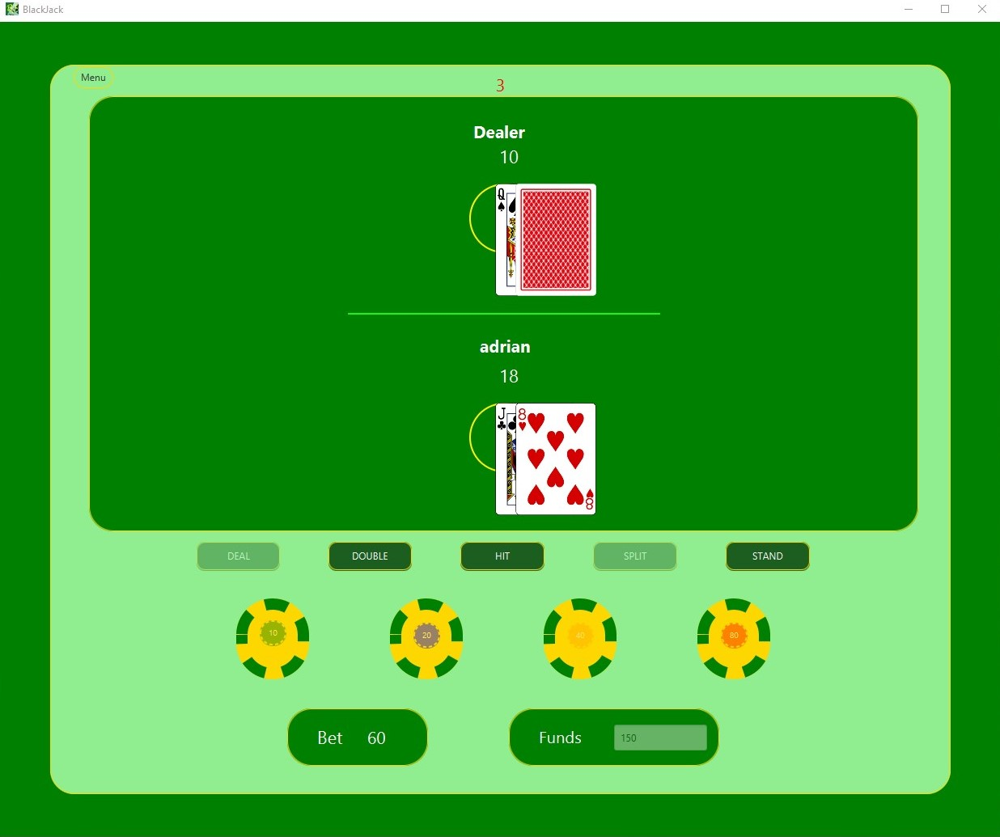
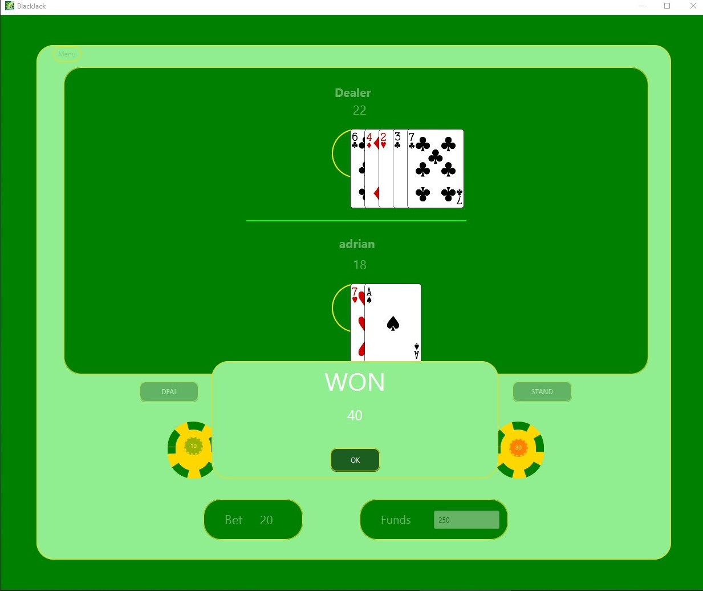
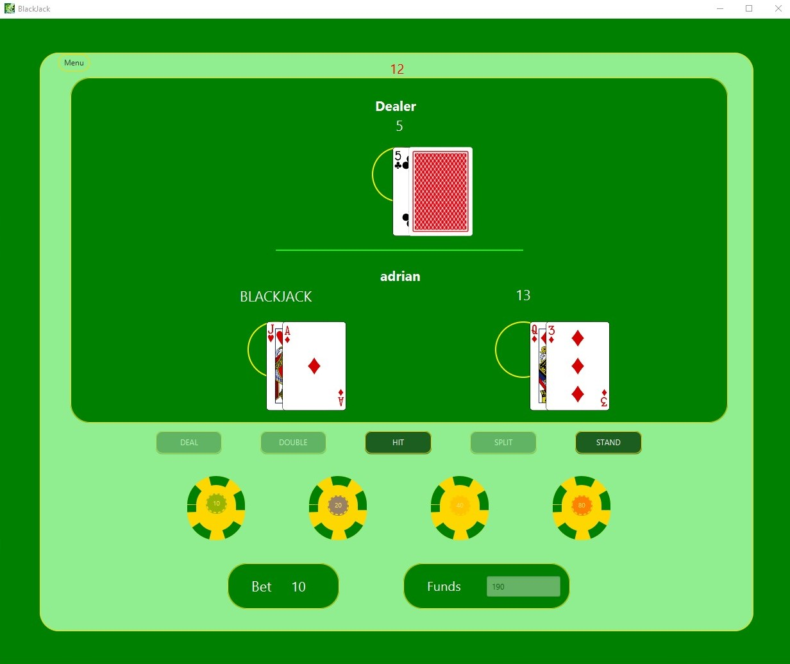
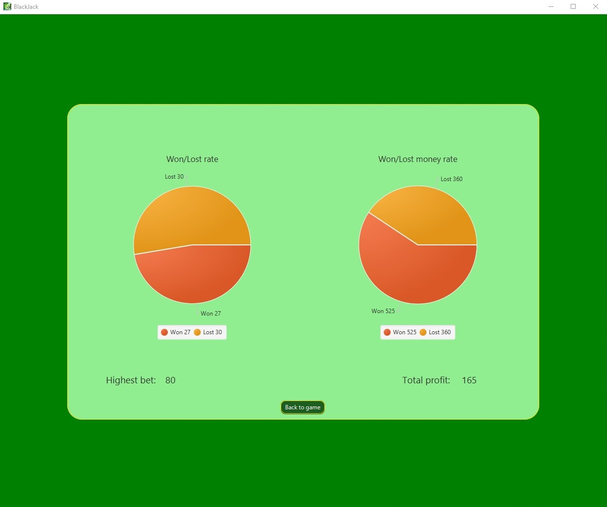

# Blackjack Game

The Blackjack (Twenty-One) card game in JavaFX.

## Requirements

Building the project requires JDK 11 or later and [Apache Maven](https://maven.apache.org/).

## Commands

#### For building reports:

mvn clean site site:stage  
./target/staging/index.html

#### For run the app:

mvn package  
java -jar ./FinalModule/target/FinalModule-1.0.jar

### Gameplay images:

